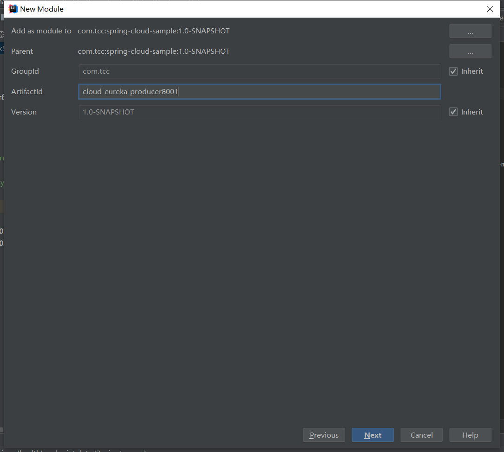
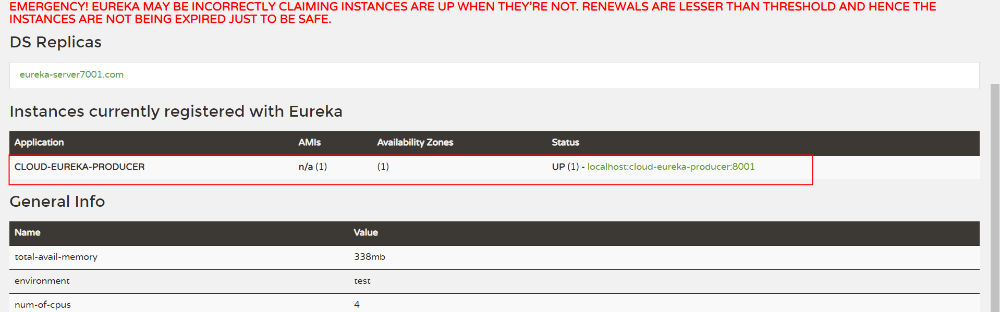
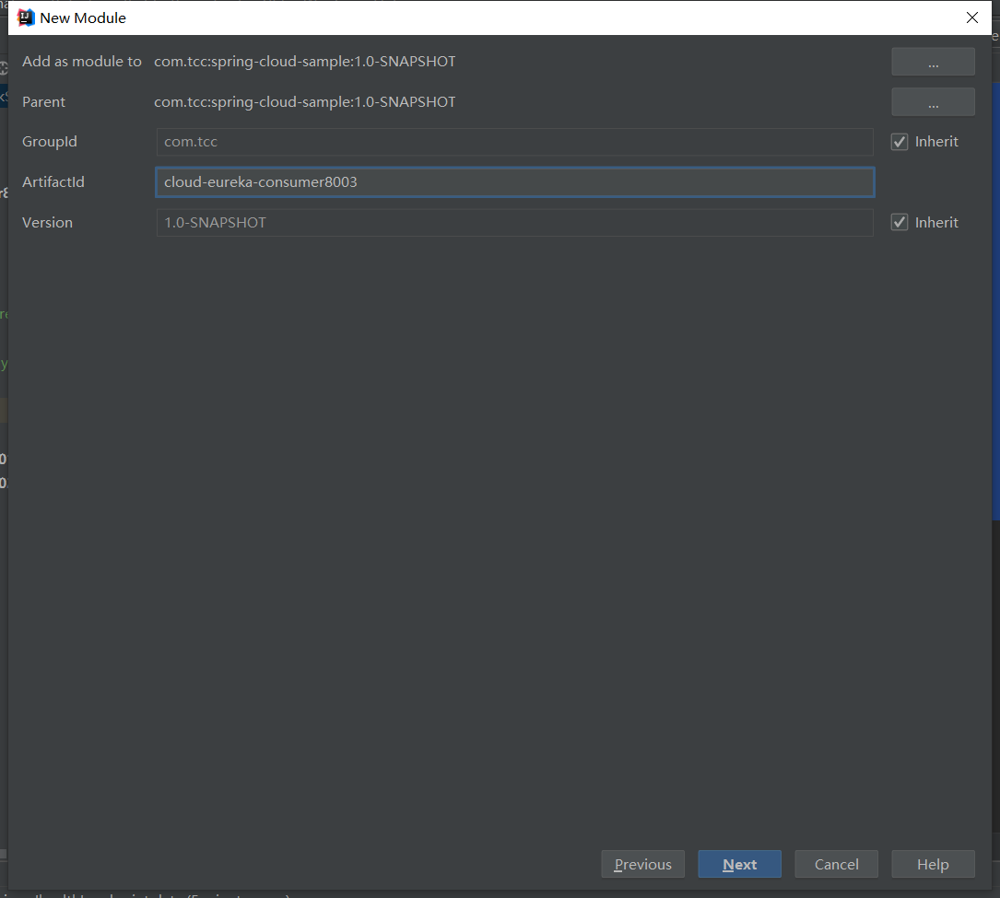
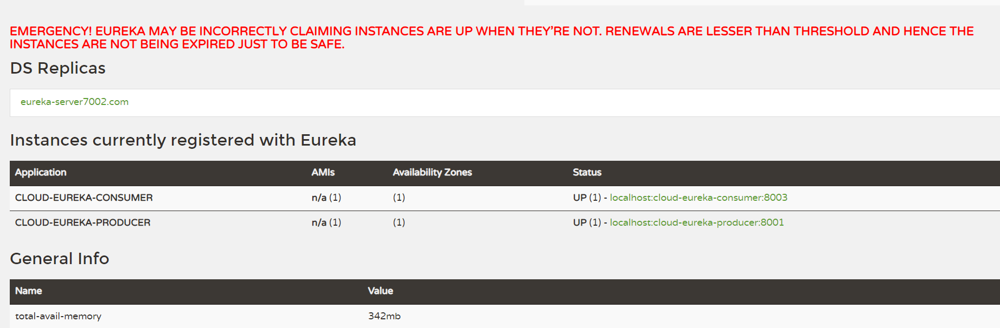
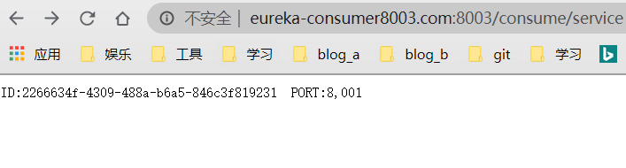

# Eureka

## 一、概述

​	Eureka是Netfilx开源的一款微服务组件，用于服务发现（Service Discovery），Eureka可搭建分布式集群，集群之间相互注册，每个服务都将所有注册到自生的服务复制到其他服务端

> 官方文档：https://cloud.spring.io/spring-cloud-static/spring-cloud-netflix/2.2.3.RELEASE/reference/html/

## 二、服务端

### 1、单机版Eureka服务

#### 1.1、新建项目cloud-eureka-server7001


#### 1.2、修改pom依赖

```xml
<dependencies>
    <dependency>
        <groupId>org.springframework.boot</groupId>
        <artifactId>spring-boot-starter-web</artifactId>
    </dependency>
    <dependency>
        <groupId>org.springframework.boot</groupId>
        <artifactId>spring-boot-starter-actuator</artifactId>
    </dependency>
    <dependency>
        <groupId>org.springframework.cloud</groupId>
        <artifactId>spring-cloud-starter-netflix-eureka-server</artifactId>
    </dependency>
</dependencies>
```

#### 1.3、添加配置文件

application.yml

```yml
server:
  port: 7001  # 服务端口号
spring:
  application:
    name: cloud-eureka-server # 应用名称/服务ID/AppName
eureka:
  instance:
    hostname: localhost
  client:
    # 把自己注册到注册中心， 默认开启(true)
    register-with-eureka: false
    # 获取注册中心的服务信息， 默认开启(true)
    fetch-registry: false
    # 服务中心地址
    service-url:
      defaultZone: http://${eureka.instance.hostname:localhost}:${server.port:7001}/eureka/
```

#### 1.4、新建启动类

cm.tcc.CloudEurekaServer7001

```java
package cm.tcc;

import org.springframework.boot.SpringApplication;
import org.springframework.boot.autoconfigure.SpringBootApplication;
import org.springframework.cloud.netflix.eureka.server.EnableEurekaServer;

/**
 * @version $Id 2020年08月01日 10:23 CloudEurekaServer7001.java $Exp
 * @auter taoch
 */
@SpringBootApplication
@EnableEurekaServer
public class CloudEurekaServer7001 {

    public static void main(String[] args) {
        SpringApplication.run(CloudEurekaServer7001.class, args);
    }

}
```

#### 1.5、运行测试


### 2、集群版Eureka服务

#### 1.1、新建项目cloud-eureka-server7002


#### 1.2、修改pom依赖

```xml
    <artifactId>cloud-eureka-server7002</artifactId>

    <dependencies>
        <dependency>
            <groupId>org.springframework.boot</groupId>
            <artifactId>spring-boot-starter-web</artifactId>
        </dependency>
        <dependency>
            <groupId>org.springframework.boot</groupId>
            <artifactId>spring-boot-starter-actuator</artifactId>
        </dependency>
        <dependency>
            <groupId>org.springframework.cloud</groupId>
            <artifactId>spring-cloud-starter-netflix-eureka-server</artifactId>
        </dependency>
    </dependencies>

```

#### 1.3、添加配置文件

> 需要在hosts文件添加如下属性，推荐使用SwitchHosts工具来管理
>
> 127.0.0.1       eureka-server7001.com
> 127.0.0.1       eureka-server7002.com


cloud-eureka-server7002项目配置文件application.yml

```yml
server:
  port: 7002  # 服务端口号
spring:
  application:
    name: cloud-eureka-server # 应用名称/服务ID/AppName
eureka:
  instance:
    hostname: eureka-server7002.com
  client:
    # 把自己注册到注册中心， 默认开启(true)
    register-with-eureka: false
    # 获取注册中心的服务信息， 默认开启(true)
    fetch-registry: false
    # 服务中心地址
    service-url:
      defaultZone: http://eureka-server7001.com:7001/eureka/
```

cloud-eureka-server7001项目配置文件application.yml需要修改service-url地址

```yml
server:
  port: 7001  # 服务端口号
spring:
  application:
    name: cloud-eureka-server # 应用名称/服务ID/AppName
eureka:
  instance:
    hostname: eureka-server7001.com
  client:
    # 把自己注册到注册中心， 默认开启(true)
    register-with-eureka: false
    # 获取注册中心的服务信息， 默认开启(true)
    fetch-registry: false
    # 服务中心地址
    service-url:
      #defaultZone: http://${eureka.instance.hostname:localhost}:${server.port:7001}/eureka/
      # 与7002相互注册
      defaultZone: http://eureka-server7002.com:7002/eureka/
```

#### 1.4、新建启动类

com.tcc.CloudEurekaServer7002

```java
package com.tcc;

import org.springframework.boot.SpringApplication;
import org.springframework.boot.autoconfigure.SpringBootApplication;
import org.springframework.cloud.netflix.eureka.server.EnableEurekaServer;

/**
 * @version $Id 2020年08月01日 10:32 CloudEurekaServer7002.java $Exp
 * @auter taoch
 */
@SpringBootApplication
@EnableEurekaServer
public class CloudEurekaServer7002 {

    public static void main(String[] args) {
        SpringApplication.run(CloudEurekaServer7002.class, args);
    }

}
```

#### 1.5、运行测试

- 访问http://eureka-server7001.com:7001/


- 访问http://eureka-server7002.com:7002/


## 三、客户端

### 3.1、服务提供方

#### 1、新建项目cloud-eureka-producer8001



#### 2、修改pom依赖

```xml
<artifactId>cloud-eureka-producer8001</artifactId>

    <dependencies>
        <dependency>
            <groupId>org.springframework.boot</groupId>
            <artifactId>spring-boot-starter-web</artifactId>
        </dependency>
        <dependency>
            <groupId>org.springframework.boot</groupId>
            <artifactId>spring-boot-starter-actuator</artifactId>
        </dependency>
        <dependency>
            <groupId>org.springframework.cloud</groupId>
            <artifactId>spring-cloud-starter-netflix-eureka-client</artifactId>
        </dependency>
    </dependencies>
```


#### 3、添加配置文件

```yml
server:
  port: 8001
spring:
  application:
    name: cloud-eureka-producer
eureka:
  instance:
    hostname: eureka-producer8001.com
  client:
    service-url:
      defaultZone: http://eureka-server7001.com:7001/eureka/,http://eureka-server7002.com:7002/eureka/
```

#### 4、新建启动类

```java
package com.tcc;

import org.springframework.boot.SpringApplication;
import org.springframework.boot.autoconfigure.SpringBootApplication;
import org.springframework.cloud.client.discovery.EnableDiscoveryClient;

/**
 * @version $Id 2020年08月02日 9:27 CloudEurekaProducer.java $Exp
 * @auter taoch
 */
@SpringBootApplication
@EnableDiscoveryClient
public class CloudEurekaProducer {

    public static void main(String[] args) {
        SpringApplication.run(CloudEurekaProducer.class, args);
    }

}

```

#### 5、运行测试



## 3.2、服务消费

#### 1、新建项目cloud-eureka-consumer8003



#### 2、pom依赖

```xml
<artifactId>cloud-eureka-consumer8003</artifactId>

    <dependencies>
        <dependency>
            <groupId>org.springframework.boot</groupId>
            <artifactId>spring-boot-starter-web</artifactId>
        </dependency>
        <dependency>
            <groupId>org.springframework.boot</groupId>
            <artifactId>spring-boot-starter-actuator</artifactId>
        </dependency>
        <dependency>
            <groupId>org.springframework.cloud</groupId>
            <artifactId>spring-cloud-starter-netflix-eureka-client</artifactId>
        </dependency>
    </dependencies>

```

#### 3、配置文件

```yml
server:
  port: 8003
spring:
  application:
    name: cloud-eureka-consumer
eureka:
  instance:
    hostname: eureka-consumer8003.com
  client:
    service-url:
      defaultZone: http://eureka-server7001.com:7001/eureka/,http://eureka-server7002.com:7002/eureka/
```

#### 4、启动类

```java
package com.tcc;

import org.springframework.boot.SpringApplication;
import org.springframework.boot.autoconfigure.SpringBootApplication;
import org.springframework.cloud.client.discovery.EnableDiscoveryClient;

/**
 * @version $Id 2020年08月02日 9:36 CloudEurekaConsumer8003.java $Exp
 * @auter taoch
 */
@SpringBootApplication
@EnableDiscoveryClient
public class CloudEurekaConsumer8003 {

    public static void main(String[] args) {
        SpringApplication.run(CloudEurekaConsumer8003.class, args);
    }

}

```

#### 5、测试

启动项目，访问注册中心http://eureka-server7001.com:7001/ 或者 http://eureka-server7002.com:7002/，可以看到服务消费方也注册上去了



#### 6、添加方法

##### 6.1、cloud-eureka-producer8001添加服务方法

> 添加一个controller类，提供一个rest 接口

```java
package com.tcc.controller;

import org.springframework.beans.factory.annotation.Value;
import org.springframework.web.bind.annotation.RequestMapping;
import org.springframework.web.bind.annotation.RequestMethod;
import org.springframework.web.bind.annotation.RestController;

import java.text.MessageFormat;
import java.util.UUID;

/**
 * @version $Id 2020年08月02日 9:40 ServiceController.java $Exp
 * @auter taoch
 */
@RestController
public class ProducerController {

    @Value("${server.port}")
    private int port;

    @RequestMapping(value = "/produce/service", method = RequestMethod.GET)
    public String service(){
        return MessageFormat.format("ID:{0}  PORT:{1}", UUID.randomUUID().toString(), port);
    }

}

```

##### 6.2、cloud-eureka-consumer8003添加接口用于访问测试

```java
package com.tcc.controller;

import org.springframework.beans.factory.annotation.Autowired;
import org.springframework.cloud.client.ServiceInstance;
import org.springframework.cloud.client.discovery.DiscoveryClient;
import org.springframework.http.ResponseEntity;
import org.springframework.web.bind.annotation.RequestMapping;
import org.springframework.web.bind.annotation.RequestMethod;
import org.springframework.web.bind.annotation.RestController;
import org.springframework.web.client.RestTemplate;

import java.text.MessageFormat;
import java.util.List;
import java.util.Optional;

/**
 * @version $Id 2020年08月02日 9:44 ComsumerController.java $Exp
 * @auter taoch
 */
@RestController
public class ConsumerController {

    /**
     * 用于发现服务，获取服务实例信息
     */
    @Autowired
    private DiscoveryClient client;

    /**
     * http客户端，访问http使用
     */
    @Autowired
    private RestTemplate restTemplate;

    @RequestMapping(value = "/consume/service", method = RequestMethod.GET)
    public ResponseEntity<String> consume(){
        // 根据服务名称获取服务实例信息 cloud-eureka-producer
        List<ServiceInstance> instances = client.getInstances("cloud-eureka-producer");
        ServiceInstance instance = Optional.ofNullable(instances).map(i -> i.stream().findFirst().orElse(null))
                .orElseThrow(()-> new RuntimeException("无可用访问实例"));
        String url = MessageFormat.format("http://{0}:{1}/produce/service", instance.getHost(), instance.getPort());
        return restTemplate.getForEntity(url, String.class);
    }

}

```

##### 6.3、测试

- producer启动后自己访问http://eureka-producer8001.com:8001/produce/service成功

- consumer启动访问http://eureka-consumer8003.com:8003/consume/service， 返回成功显示produce提供的数据



## 四、自我保护机制

> eureka在经典的CAP定理中属于AP，保证了可用性和分区容错性
>
> eureka默认会开启一个自我保护功能，注册中心会暂时不剔除受保护的应用
>
> 该参数使用 eureka.server.enable-self-preservation参数设置，默认开启