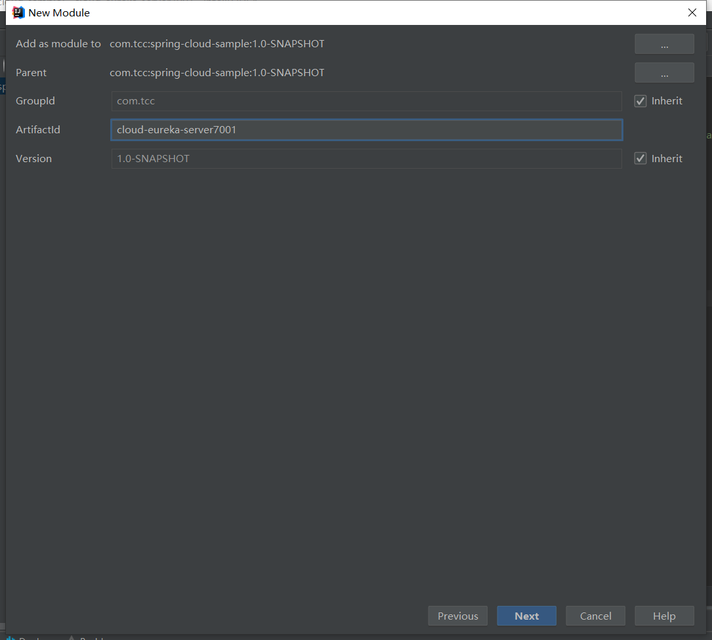
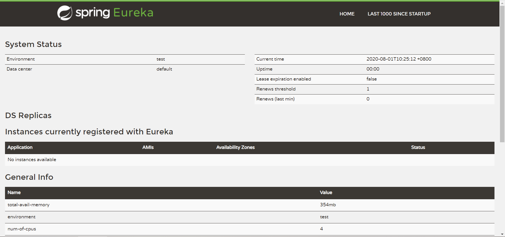
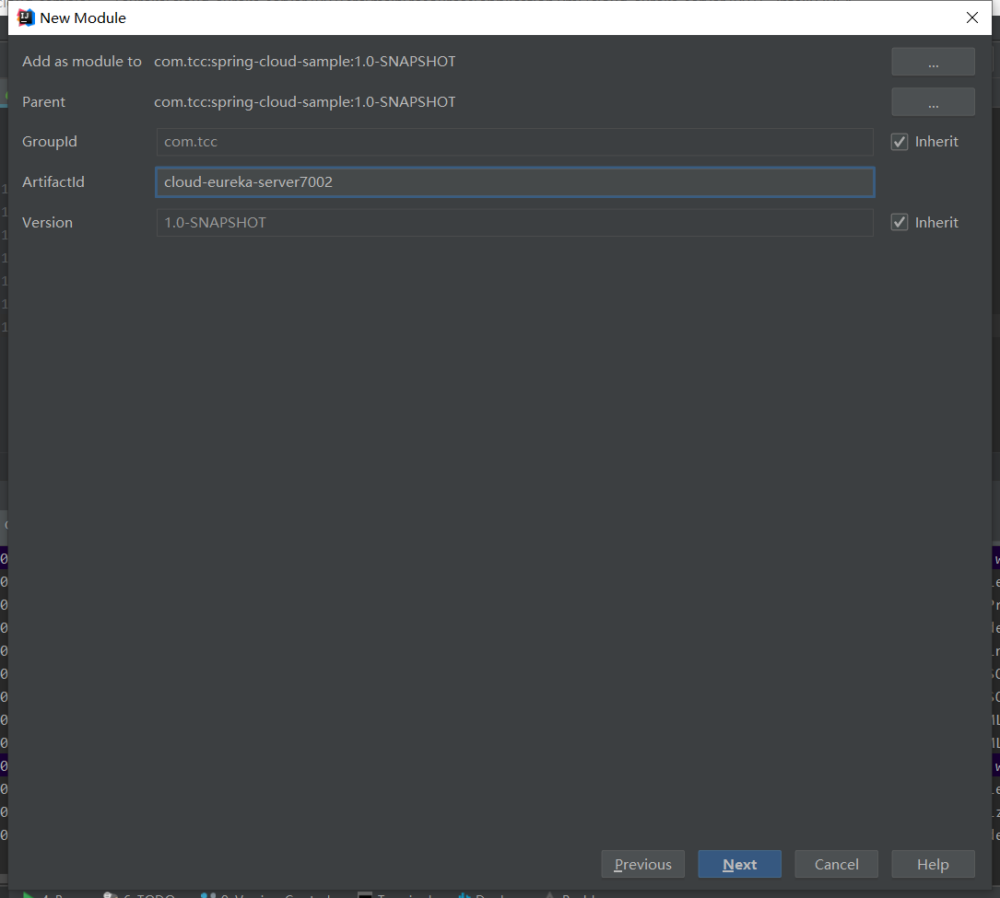
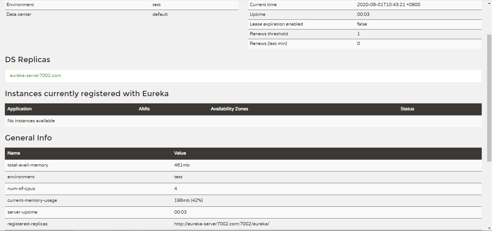
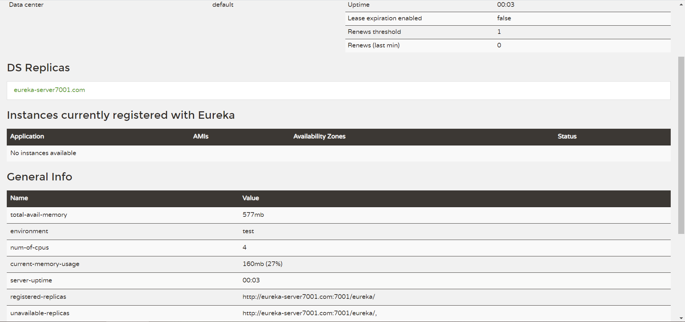

# Eureka

## 一、概述

​	Eureka是Netfilx开源的一款微服务组件，用于服务发现（Service Discovery），Eureka可搭建分布式集群，集群之间相互注册，每个服务都将所有注册到自生的服务复制到其他服务端

> 官方文档：https://cloud.spring.io/spring-cloud-static/spring-cloud-netflix/2.2.3.RELEASE/reference/html/

## 二、服务端

### 1、单机版Eureka服务

#### 1.1、新建项目cloud-eureka-server7001



#### 1.2、修改pom依赖

```xml
<dependencies>
    <dependency>
        <groupId>org.springframework.boot</groupId>
        <artifactId>spring-boot-starter-web</artifactId>
    </dependency>
    <dependency>
        <groupId>org.springframework.boot</groupId>
        <artifactId>spring-boot-starter-actuator</artifactId>
    </dependency>
    <dependency>
        <groupId>org.springframework.cloud</groupId>
        <artifactId>spring-cloud-starter-netflix-eureka-server</artifactId>
    </dependency>
</dependencies>
```

#### 1.3、添加配置文件

application.yml

```yml
server:
  port: 7001  # 服务端口号
spring:
  application:
    name: cloud-eureka-server # 应用名称/服务ID/AppName
eureka:
  instance:
    hostname: localhost
  client:
    # 把自己注册到注册中心， 默认开启(true)
    register-with-eureka: false
    # 获取注册中心的服务信息， 默认开启(true)
    fetch-registry: false
    # 服务中心地址
    service-url:
      defaultZone: http://${eureka.instance.hostname:localhost}:${server.port:7001}/eureka/
```

#### 1.4、新建启动类

cm.tcc.CloudEurekaServer7001

```java
package cm.tcc;

import org.springframework.boot.SpringApplication;
import org.springframework.boot.autoconfigure.SpringBootApplication;
import org.springframework.cloud.netflix.eureka.server.EnableEurekaServer;

/**
 * @version $Id 2020年08月01日 10:23 CloudEurekaServer7001.java $Exp
 * @auter taoch
 */
@SpringBootApplication
@EnableEurekaServer
public class CloudEurekaServer7001 {

    public static void main(String[] args) {
        SpringApplication.run(CloudEurekaServer7001.class, args);
    }

}
```

#### 1.5、运行测试



### 2、集群版Eureka服务

#### 1.1、新建项目cloud-eureka-server7002



#### 1.2、修改pom依赖

```xml
    <artifactId>cloud-eureka-server7002</artifactId>

    <dependencies>
        <dependency>
            <groupId>org.springframework.boot</groupId>
            <artifactId>spring-boot-starter-web</artifactId>
        </dependency>
        <dependency>
            <groupId>org.springframework.boot</groupId>
            <artifactId>spring-boot-starter-actuator</artifactId>
        </dependency>
        <dependency>
            <groupId>org.springframework.cloud</groupId>
            <artifactId>spring-cloud-starter-netflix-eureka-server</artifactId>
        </dependency>
    </dependencies>

```

#### 1.3、添加配置文件

> 需要在hosts文件添加如下属性，推荐使用SwitchHosts工具来管理
>
> 127.0.0.1       eureka-server7001.com
> 127.0.0.1       eureka-server7002.com


cloud-eureka-server7002项目配置文件application.yml

```yml
server:
  port: 7002  # 服务端口号
spring:
  application:
    name: cloud-eureka-server # 应用名称/服务ID/AppName
eureka:
  instance:
    hostname: eureka-server7002.com
  client:
    # 把自己注册到注册中心， 默认开启(true)
    register-with-eureka: false
    # 获取注册中心的服务信息， 默认开启(true)
    fetch-registry: false
    # 服务中心地址
    service-url:
      defaultZone: http://eureka-server7001.com:7001/eureka/
```

cloud-eureka-server7001项目配置文件application.yml需要修改service-url地址

```yml
server:
  port: 7001  # 服务端口号
spring:
  application:
    name: cloud-eureka-server # 应用名称/服务ID/AppName
eureka:
  instance:
    hostname: eureka-server7001.com
  client:
    # 把自己注册到注册中心， 默认开启(true)
    register-with-eureka: false
    # 获取注册中心的服务信息， 默认开启(true)
    fetch-registry: false
    # 服务中心地址
    service-url:
      #defaultZone: http://${eureka.instance.hostname:localhost}:${server.port:7001}/eureka/
      # 与7002相互注册
      defaultZone: http://eureka-server7002.com:7002/eureka/
```

#### 1.4、新建启动类

com.tcc.CloudEurekaServer7002

```java
package com.tcc;

import org.springframework.boot.SpringApplication;
import org.springframework.boot.autoconfigure.SpringBootApplication;
import org.springframework.cloud.netflix.eureka.server.EnableEurekaServer;

/**
 * @version $Id 2020年08月01日 10:32 CloudEurekaServer7002.java $Exp
 * @auter taoch
 */
@SpringBootApplication
@EnableEurekaServer
public class CloudEurekaServer7002 {

    public static void main(String[] args) {
        SpringApplication.run(CloudEurekaServer7002.class, args);
    }

}
```

#### 1.5、运行测试

- 访问http://eureka-server7001.com:7001/



- 访问http://eureka-server7002.com:7002/



## 三、客户端

#### 1、新建项目cloud-eureka-server8001


#### 2、修改pom依赖


#### 3、添加配置文件


#### 4、新建启动类


#### 5、运行测试

## 四、自我保护机制